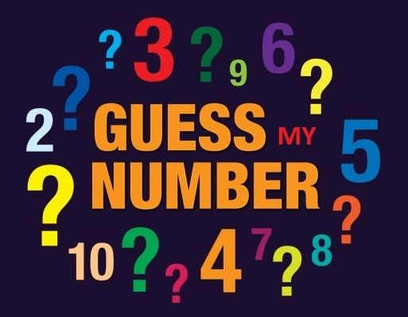

:page-layout: standard_toc
:page-title: Year 9 IST - Assignment One
:icons: font

= Year 9 IST - Assignment One (Semester One)

*Weight:* 25% +
*Due:* Thursday 19 March 2020 (Week 7) by 8:45am

== Changelog

This assignment was last updated on *Monday 17 February 2020*.

If any changes are made to the assignment they will be itemised here for ease of identification.

== Task Context

In this assignment you are going to recreate the game of Rock Paper Scissors from last year, where you need to try and beat the computer at this well-known game. This time, however, you will be using *Node.js* to create a server-side version of the game. Additionally, you are also going to create the game of Guess The Number, where you keep guessing a number between 0 and 10 until you get the correct answer.

=== Marking guidelines

Make sure that you consult the <<_marking_guidelines, marking guidelines>> at the end of this document to ensure that your submission meets all the requirements.

=== Reporting Criteria

* Demonstrating a good understanding of Linux-based command line interfaces
* Demonstrating a good knowledge of the core Node.js concepts including routing
* Demonstrating sufficient overall knowledge of Node.js to effectively write an entirely working program from scratch
* Including sufficient comments and other intrinsic documentation, such as appropriate variable naming, to explain the purpose of the code

== Task Description

You have been re-employed by the same major US cable television network from last year, to create a *Node.js* version of *Extreme Rock Paper Scissors*. They are also introducing a new show called *Guess My Number*.

Fortunately, an engineer (who has mysteriously disappeared) uploaded some partially complete games in ED STEM called *Assignment 1 (Semester One) - Template* which you can fork. This contains some starting Node.js files for your game. Your job is to finish the JavaScript code to make the game function.

=== Your Task

Below are the tasks you need to complete.

Make sure that you view the <<_example_output, example output videos>> to check that your program meets all the requirements.

==== Express (-3 marks)

Use of `Express` is expressly forbidden for this assignment. If there are any references to `Express` in your code, 3 marks will automatically be deducted. This is an intentional way of making the task more of a challenge, to cultivate a deeper understanding of `Node.js` and routing.

==== Extreme Rock, Paper, Scissors (13 marks)

*Implement the `/player/` routes (3 marks).*

* `/player/0` should display the text `rock`
* `/player/1` should display the text `paper`
* `/player/2` should display the text `scissors`

*Implement the `/random/` routes (3 marks).*

* `/random/number` should display a random number `between 0 and 2`
* `/random/gesture` should display a random gesture (text): `rock`, `paper` or `scissors`
* `/random/image` should display a random image (`rock.png`,`paper.png` or `scissors.png`)

*Implement the `/game/` routes (5 marks).*

* Create a route for `/game/0`, `/game/1` and `/game/2`
* For each route, store and display the player's chosen gesture (`/game/0` = 'rock', `/game/1` = 'paper', `/game/2` = 'scissors'  )
* For each route, randomly choose, store and display the computer's gesture (text): `rock`, `paper` or `scissors`
* For each route, check and display the winner of the game
* *NOTE:* You should make use of functions to avoid copying and pasting the same code for each route

*Implement the `/scores` route (2 marks).*

* Create and update variables to track the number of `player wins`, `computer wins` and `ties`
* Display the number of `player wins`, `computer wins` and `ties` using the `/scores` route

==== Guess My Number (10 marks)

*Implement the `/random/` and `/start` routes (2 marks).*

* `/random/10` should display a random number `between 0 and 10`
* `/random/100` should display a random number `between 0 and 100`
* `/start/10` should store a random number `between 0 and 10` (without displaying the answer)

*Implement the `/guess/` routes (5 marks).*

* Using a for loop, create a route for `/guess/0` up to `guess/10`
* For each route, if the answer was correctly guessed, display the text `Correct!`
* For each route, if the answer is higher than the number guessed, display the text `Higher...`
* For each route, if the answer is lower than the number guessed, display the text `Lower...`
* Create, update and display a variable to count how many guesses the user has taken. For each of the options above, add the text `You have guessed ? times`. For example, `Higher...You have guessed 2 times` or `Correct! You have guessed 3 times`

*Implement enhanced functionality (3 marks).*

* Fix the grammar of the `/guess` routes when only one guess has been made. It should say `You have guessed once` instead of `You have guessed 1 times`
* Store all previous guesses in an array. If the same URL is entered more than once, it should display `You have already guessed this number`
* Store all previous answers and scores, and use a `/scores` route to display them

==== Code Comments (2 marks)

* Ensure that you include sufficient comments and other intrinsic documentation, such as appropriate variable naming, to explain the purpose of the code

[#_example_output]
== Example Output

The videos below show what your output needs to look like, when accessing each URL:

*Extreme Rock Paper Scissors*

video::ExtremeRockPaperScissors.ogg[width=380]

*Guess My Number*

video::GuessMyNumber.ogg[width=380]

== Submission Instructions

This assignment is worth 25% of your Semester One assessment for this subject.

To submit your assignment you do not need to do anything, we will view your submission in your ED STEM workspace. However, you *must not* change your workspace after the due date and time. We can see the revision history on your workspace and will be actively checking the last time you modified the workspace.

*Late submissions will incur penalties as per the school assessment policy:* For assignments and non-test events a late work penalty of 10% of the total possible mark will be incurred for each day late if work is not submitted on the due date. A loss of 30% is incurred if work due on a Friday is not submitted until the following Monday. After one week (7 days) the item will be awarded a mark of zero.

=== Draft submissions

You may optionally (but strongly encouraged) submit one draft of your assignment for review prior to formal submission. Your draft must be feature complete (i.e. not a half-done assignment) and submitted at least one week before the assignment due date - for this assignment, drafts are due by 8:45am on Thursday 12 March 2020). To submit a draft email your teacher and let them know your workspace is ready to be reviewed.

[#_marking_guidelines]
=== Marking Guidelines

link:marking-guidelines.pdf[Your assignment will be marked following the criteria in this PDF file.^]

[#_academic_honesty]
== Academic Honesty

include::../common/academic_honesty.adoc[]
