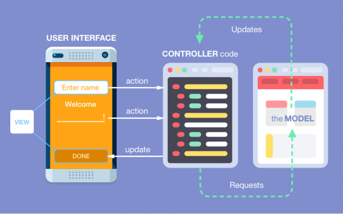

:page-layout: standard_toc
:page-title: Year 9 IST - Assignment Two
:icons: font

= Year 9 IST - Assignment Two

*Weight:* 40% +
*Due:* Thursday 28 May 2020 (Week 15) by 8:45am

== Changelog

This assignment was last updated on *Monday 30 March 2020*.

If any changes are made to the assignment they will be itemised here for ease of identification.

== Task Context

In this assignment you are going to complete an entirely working Node.js application from scratch. You will be required to demonstrate a good knowledge of Express, MongoDB and the principles of CRUD.

=== Marking guidelines

Make sure that you consult the <<_marking_guidelines, marking guidelines>> at the end of this document to ensure that your submission meets all the requirements.

=== Reporting Criteria

* Demonstrating a good understanding of Linux-based command line interfaces
* Demonstrating a good knowledge of the core Node.js concepts including routing and templating using frameworks such as Express
* Demonstrating sufficient overall knowledge of Node.js to effectively write an entirely working program from scratch
* Understanding how to use MongoDB within a Node.js application
* Demonstrates good modelling of data within programs using the principles of CRUD
* Including sufficient comments and other intrinsic documentation, such as appropriate variable naming, to explain the purpose of the code

== Task Description

To provide a purposeful real-world task that demonstrates meaningful application of your skills, you are required to complete your own implementation of a *To Do List Application*.

This will require you to apply your newly learned skills in writing Node.js, in addition to general skills in HTML, CSS and JavaScript.

=== Marking guidelines

Make sure that you consult the <<_marking_guidelines, marking guidelines>> at the end of this document to ensure that your submission meets all the requirements.

== Task Requirements

Your application will involve three major components, based on MVC architecture.

* *Model*: The business logic and data of your application
* *View*: The format and layout of data in your user interface
* *Controller*: Sends requests and updates between the view and model layers

=== Designing your application

Rather than focusing purely on programming skills, here is a chance for you to demonstrate good design principles. Here are some questions that you need to address in your application design.

==== Model

* How will you store and structure data within MongoDB?
* How will your data be created, read, updated and deleted?
* How will this data be used for the purpose of a To Do List Application

==== View

* What information will you need to present to your users?
* How will the information flow work in terms of input, processing and output?
* What components do you need to include in your user interface?

==== Controller

* How will you connect your user interface to your modelled data?
* What *routes* will you need to create?
* What data will need to be passed to and returned from your controller *actions*?

=== Implementing your application

Although the choice of how your To Do List Application works is up to you, below are some guidelines on the functionality that we expect to see:

==== Model

* *Essential data*: Task names or descriptions, and a way to view complete and incomplete tasks
* *Custom attributes (optional)*: Subjects/categories, priority, sub-tasks, percentage of task done, etc.
* *Validations (optional)*: Appropriate data types and properties, such as the format of an email address.
* *Instance methods (optional)*: Functions that relate directly to the data model. For example, combining a first name and last name, to return a full name. Although you could get away with writing this code elsewhere, including this with your data model is better because it makes it easy to reuse anywhere (e.g. if you created a mobile app to interact with your database). 

==== View

* *Home page*: A welcome page including a brief description of the purpose of your website
* *Application design*: A page dedicated to answering the questions in the previous section about how you designed your application, based on MVC architecture
* *Navigation*: A simple navigation menu that appears on all pages that is functional and intuitive
* *Tasks*: A page where you can view tasks on your To Do List
* *CRUD*: An interface that allows you to create, read, update and delete tasks

==== Controller

* *Routes*: URIs should be logically named and make use of the principles of CRUD. This would typically be configured in your *main.js* file, making use of *Express*.
* *Actions*: You are expected to use *Mongoose* to connect your requests to the data stored in *MongoDB*. This would typically be configured within your *controllers* folder.
* *Render views and layouts*: You are expected to use views and layouts to display a combination of static and dynamic data, with a consistent, aesthetic style. This would typically be configured within your *views* folder.

== Submission Instructions ==

This assignment is worth 40% of your Semester One assessment for this subject.

To submit your assignment you do not need to do anything, we will view your submission in your ED STEM workspace. However, you *must not* change your workspace after the due date and time. We can see the revision history on your workspace and will be actively checking the last time you modified the workspace.

*Late submissions will incur penalties as per the school assessment policy:* For assignments and non-test events a late work penalty of 10% of the total possible mark will be incurred for each day late if work is not submitted on the due date. A loss of 30% is incurred if work due on a Friday is not submitted until the following Monday. After one week (7 days) the item will be awarded a mark of zero.

[#_marking_guidelines]
=== Marking Guidelines ===

link:marking-guidelines.pdf[Your assignment will be marked following the criteria in this PDF file.^]

[#_academic_honesty]
== Academic Honesty

include::../common/academic_honesty.adoc[]
