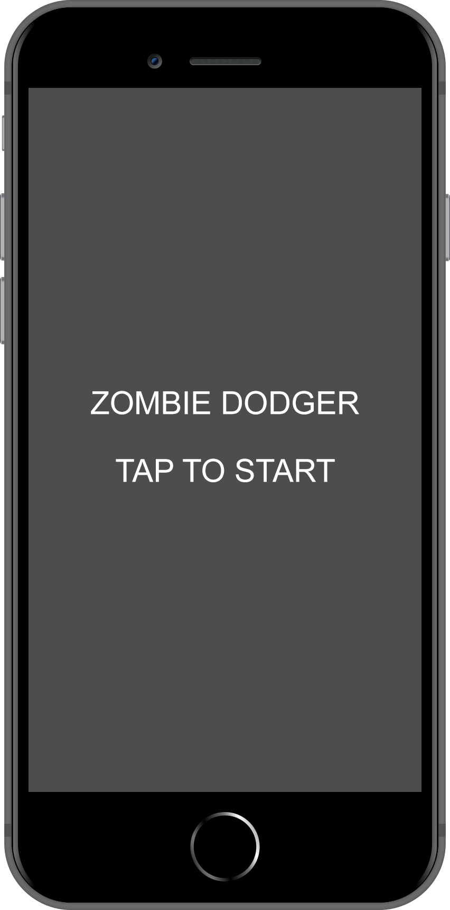
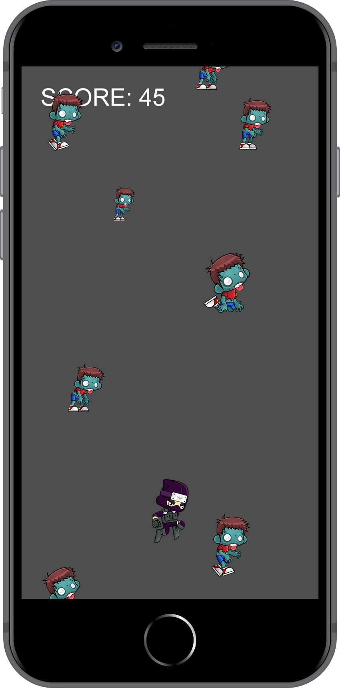
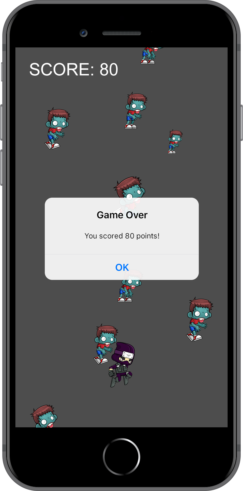

:page-layout: standard_toc
:page-title: Year 9 IST - Assignment One
:icons: font

= Year 9 IST - Assignment One (Semester Two) =

*Weight:* 30% +
*Due:* Tuesday 1 September 2020 (Week 7) by 8:45am

== Changelog ==

This assignment was last updated on *Friday 3 July 2020*.

== Task Description ==

For this assignment you are going to be developing your own themed version of a game where you `_dodge enemies or obstacles_`.

Below is an example of an `_apocalyptic_` themed game called Zombie Dodger. The concept of the game is that zombies fall from the top of the screen and the player (in this case, the ninja character) needs to avoid them. The ninja can be controlled by the player with their mouse (i.e. clicking and dragging the ninja around to avoid the falling zombies). Similarly, if the game is being run on an actual device then the ninja is controlled by the player with their finger by tap, hold, and dragging the ninja.

The longer the player lasts without being hit by a zombie, the higher their score.

Some screen shots of the key game screens/scenes are included below.

.Example splash screen
[caption="", link=zombie_dodger1.png]

.Example game screen
[caption="", link=zombie_dodger2.png]

.Example end game screen
[caption="", link=zombie_dodger3.png]

A video of a sample game/app, which you need to replicate, is not being provided for this assignment &mdash; we want you to develop this game with your own flair. *Your game does not need to look identical to the screen shots above &mdash; it just needs to function consistent the description and minimum requirements of the game* which are outlined below (and also in the <<_marking_guidelines, marking guidelines>>). So long as your game meets these requirements, and is true to the concept of the game, you will get your marks!

There is also no template, you will need to create your Xcode project from scratch.

_Why are we doing this? I want a sample app!_ The reason is that, now you have experience in game development through examples completed during class, we want you to make decisions about how the gameplay should work so that you can produce a playable game. It also means that when marking we are looking at your game as a whole, rather than specifically looking to see whether you exactly replicated a sample app we gave you &mdash; making it much easier to award you marks!

=== Game Description and Minimum Requirements (15 marks) ===

The game should following this general workflow:

* When the app starts it should present the player with a splash screen which they tap to start the game. This avoids the situation where the app loads and the game immediately starts, but the player might not be ready (or expecting) the game to start. See the _Example splash screen_ above for an idea about what is expected.

* When the game first launches the player's character (e.g. ninja) should start in the middle of the screen. Enemies or obstacles (e.g. zombies), of different sizes and different images, should then spawn and drop from the top of the screen. To make the game achievable, new enemies or obstacles (e.g. zombies) should spawn and drop around every 3 - 4 seconds. You will need to make your own judgment about how fast they should fall. Remember, the game should be challenging but achievable.

* The graphics that you are allowed to use are all provided in the project source folder for the *Dive into SpriteKit tutorial series* which we covered in class.

* The player gets 1 point for every second they are "alive", so each second that goes past should increment the score by 1.

* If the player (e.g.) ninja contacts any of the enemies or projectiles (e.g zombies) then it's game over &mdash; the game should pause, an alert (or similar) should appear showing the player's score, and then a button (or similar) allows the user to go back to the main splash screen and start a new game, if they wish.

IMPORTANT: This game only needs to be designed for the iPad. You do not need to consider or design for any other screen sizes.

=== Swift Code Formatting (5 marks)  ===

* You are required to provide descriptive code comments, camelCase variable names and appropriate whitespace/indenting

=== Enhancements (10 marks)  ===

There are five enhancement tasks, designed to reward students who are able to complete additional challenges.

1. Every 10 seconds increase the difficulty of the game by making the zombies fall *slightly* faster and spawn more frequently. The key here is slightly, you almost want the player not to realise the game is getting more difficult!

2. Similar to the flappy birds variation game in Project 3, choose some background layer textures to produce a parallax scrolling effect to add depth to the visuals of the game.

3. Implement a power-up where the player needs to contact the power up to receive its special powers. The power up should only appear very occasionally. When activated, will make the game go very quickly for 10 seconds and give the player invincibility...essentially giving them free points while the power up is active. You can work out the finer details of how this should operate.

4. Implement another label which shows the highest score which has been achieved in the game overall.

5. Animate the player and enemies/obstacles using multi-frame textures.

You can attempt any (or all) of the above enhancement tasks in any order (you do not need to complete the first task to complete the second, etc. &mdash; each task is designed to be standalone).

IMPORTANT: *If you attempt any of the enhancement tasks then please put a comment at the top of your GameScene.swift file telling us which enhancement task(s) you attempted.* If you do not then it is difficult for us to tell what you have done and you may not receive marks for this section!

=== Credits ===

The texture packs (zombies and ninja) were sourced from https://www.gameart2d.com/freebies.html[Game Art 2D^] and are available for use under a https://www.gameart2d.com/license.html[Creative Commons Zero licence^].

=== Outcomes/Assessment Criteria ===

* 5.1.1 select and justify the application of appropriate software programs to a range of tasks
* 5.2.1 describe and apply problem-solving processes when creating solutions
* 5.2.2 design, produce and evaluate appropriate solutions to a range of challenging problems
* 5.2.3 critically analyse decision making processes in a range of information and software solutions

== Submission Instructions ==

This assignment is worth 30% of your Semester One assessment for this subject.

You must place the following declaration (in the form of a comment) at the top of your main view controller file:

....
//
// I am committed to being a person of integrity.
// This project is submitted as part of the assessment for Year 9 IST.
// This is all my own work. I have referenced any work used from other
// sources and have not plagiarised the work of others.
// (signed) Name here
//
....

Make sure you understand the implications of this declaration which you are including and digitally signing (see the <<_academic_honesty, Academic Honesty>> section of this document for more information).

*If you do not include the student declaration at the top of your main view controller file your assignment will not be marked and you will receive zero.*

To submit, ZIP your *entire Xcode project folder* and upload the file to http://submit.cgscomputing.com/year10-s2assign1[http://submit.cgscomputing.com/year10-s2assign1^]. Make sure to correctly enter your name and school email address, so that your submission can be located.

*Late submissions will incur penalties as per the school assessment policy:* Students will lose 10% of the total value of the assessment per day late, or part thereof. 

=== Draft submissions ===

You may optionally (but strongly encouraged) submit one draft of your assignment for review prior to formal submission. Your draft must be feature complete (i.e. not a half-done assignment) and submitted at least one week before the assignment due date - for this assignment, drafts are due by 8:45am on Tuesday 26 August 2020). To submit a draft email your teacher with a ZIP copy of your project.

[#_marking_guidelines]
=== Marking Guidelines ===

link:marking-guidelines.pdf[Your assignment will be marked following the criteria in this PDF file.^]

*Note:* These marking guidelines are subject to change/update &mdash; particularly if something is brought to our attention we didn't consider when writing the assignment. Any such updates will be highlighted in the changelog.

[#_academic_honesty]
== Academic Honesty

include::../common/academic_honesty.adoc[]
