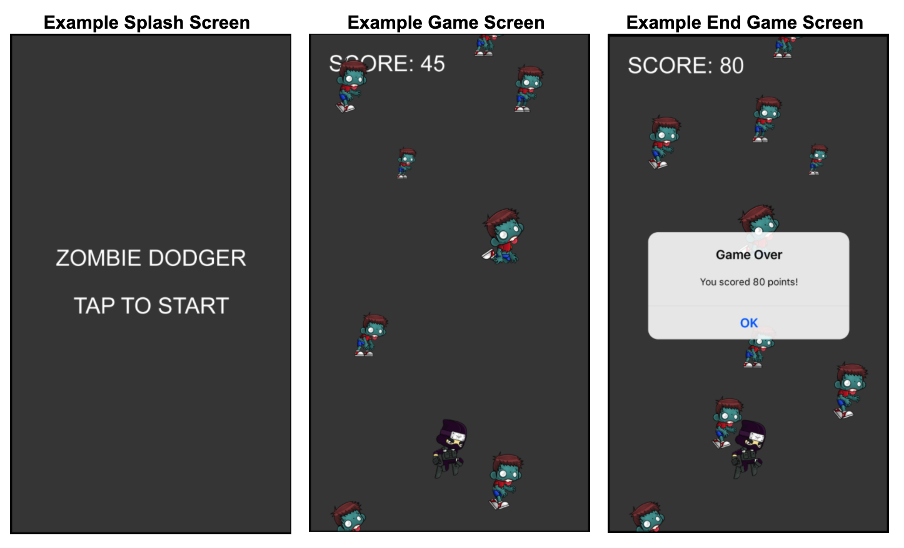

:page-layout: standard_toc
:page-title: Year 9 IST - Assignment One
:icons: font

= Year 9 IST - Assignment One (Semester One) =

*Weight:* 20% +
*Due:* Monday 29 March 2021 (Week 9) by 8:45am

== Changelog ==

This assignment was last updated on *Wednesday 17 March 2021*.

* *UPDATE WEDNESDAY 17 MARCH*: Updated weight to 20% to match the assessment table, updated the heading to Semester One and updated submission instructions.

* *UPDATE THURSDAY 18 MARCH*: Updated marking guidelines with refined requirements and optional extension tasks, and included the requirement to build an executable application file as part of the submission instructions.

== Task Description ==

For this assignment you are going to be developing your own themed version of a game where you `_dodge enemies or obstacles_`.

Below is an example of an `_apocalyptic_` themed game called Zombie Dodger. The concept of the game is that zombies fall from the top of the screen and the player (in this case, the ninja character) needs to avoid them.

The longer the player lasts without being hit by a zombie, the higher their score.

Some screen shots of the key game screens/scenes are included below.

A video of a sample game/app, which you need to replicate, is not being provided for this assignment &mdash; we want you to develop this game with your own flair. *Your game does not need to look identical to the screen shots above &mdash; it just needs to function consistent with the description and minimum requirements of the game* which are outlined below (and also in the <<_marking_guidelines, marking guidelines>>). So long as your game meets these requirements, and is true to the concept of the game, you will get your marks!

There is also no template, you will need to create your Unity project from scratch.

_Why are we doing this? I want a sample app!_ The reason is that, now you have experience in game development through examples completed during class, we want you to make decisions about how the gameplay should work so that you can produce a playable game. It also means that when marking we are looking at your game as a whole, rather than specifically looking to see whether you exactly replicated a sample app we gave you &mdash; making it much easier to award you marks!

=== Game Description and Minimum Requirements (15 marks) ===

The game should following this general workflow:

* When the app starts it should present the player with a splash screen which they tap to start the game. This avoids the situation where the app loads and the game immediately starts, but the player might not be ready (or expecting) the game to start. See the _Example splash screen_ above for an idea about what is expected.

* When the game first launches the player's character (e.g. ninja) should start in the middle of the bottom section of the screen. Enemies or obstacles (e.g. zombies), with varying sizes and speed, should then spawn and drop from the top of the screen. To make the game achievable, new enemies or obstacles (e.g. zombies) should spawn and drop every 2 seconds. You will need to make your own judgment about how fast they should fall. Remember, the game should be challenging but achievable.

* The player's character movement can be controlled by using the left and right arrow keys.

* You are encouraged to source your own assets to enable customisation of your game.

* The player gets 1 point for every second they are "alive", so each second that goes past should increment the score by 1.

* If the player (e.g.) ninja contacts any of the enemies or projectiles (e.g zombies) then it's game over &mdash; the game should pause, an alert (or similar) should appear showing the player's score, and then a button (or similar) allows the user to go back to the main splash screen and start a new game, if they wish.

=== Code Formatting (5 marks)  ===

* You are required to provide descriptive code comments, camelCase variable names and appropriate whitespace/indenting

=== Credits ===

The texture packs (zombies and ninja) were sourced from https://www.gameart2d.com/freebies.html[Game Art 2D^] and are available for use under a https://www.gameart2d.com/license.html[Creative Commons Zero licence^].

=== Outcomes/Assessment Criteria ===

* 5.1.1 select and justify the application of appropriate software programs to a range of tasks
* 5.2.1 describe and apply problem-solving processes when creating solutions
* 5.2.2 design, produce and evaluate appropriate solutions to a range of challenging problems
* 5.2.3 critically analyse decision making processes in a range of information and software solutions

== Submission Instructions ==

This assignment is worth 20% of your Semester One assessment for this subject.

You must place the following declaration (in the form of a comment) at the top of your main player behaviour script file:

....
//
// I am committed to being a person of integrity.
// This project is submitted as part of the assessment for Year 9 IST.
// This is all my own work. I have referenced any work used from other
// sources and have not plagiarised the work of others.
// (signed) Name here
//
....

Make sure you understand the implications of this declaration which you are including and digitally signing (see the <<_academic_honesty, Academic Honesty>> section of this document for more information).

*If you do not include the student declaration at the top of your main player behaviour script file your assignment will not be marked and you will receive zero.*

To submit, *build an executable application file* within your project folder, then *ZIP your entire project folder* and upload the file to https://www.dropbox.com/request/dg7q2NZ1QScckgXsUvRF[http://submit.cgscomputing.com/year9-s1assign1^]. Make sure to correctly enter your name and school email address, so that your submission can be located.

*Late submissions will incur penalties as per the school assessment policy:*

=== Draft submissions ===

You may optionally (but strongly encouraged) submit one draft of your assignment for review prior to formal submission. Your draft must be feature complete (i.e. not a half-done assignment) and submitted at least one week before the assignment due date - for this assignment, drafts are due by 8:45am on Monday 22 March 2021). To submit a draft email your teacher with a ZIP copy of your project.

[#_marking_guidelines]
=== Marking Guidelines ===

link:marking-guidelines.pdf[Your assignment will be marked following the criteria in this PDF file.^]

*Note:* These marking guidelines are subject to change/update &mdash; particularly if something is brought to our attention we didn't consider when writing the assignment. Any such updates will be highlighted in the changelog.

[#_academic_honesty]
== Academic Honesty

include::../common/academic_honesty.adoc[]
